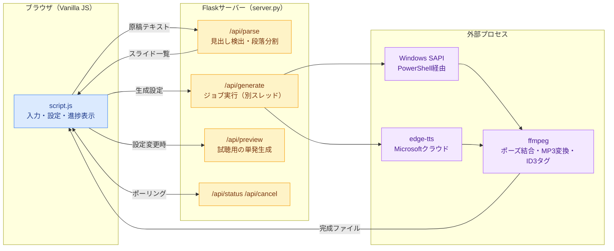
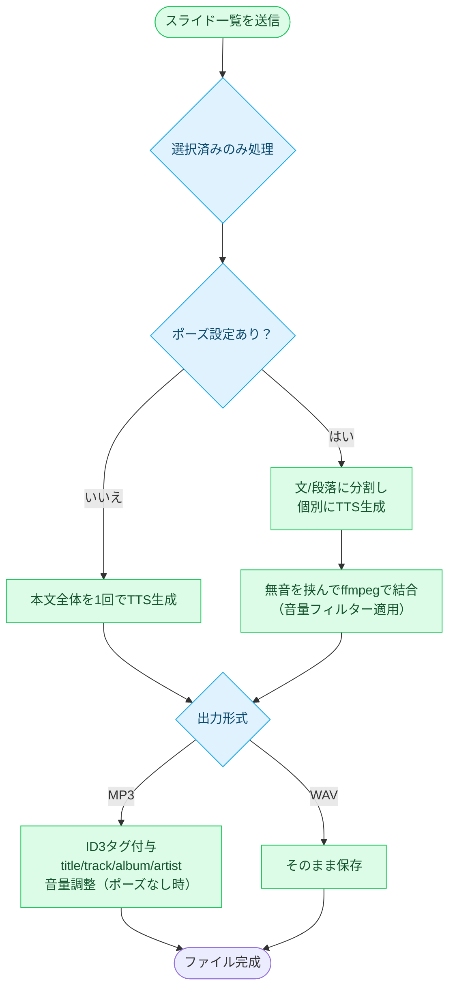

# Slide Audio App

プレゼン原稿テキストを、スライド（見出し）ごとの音声ファイル（MP3/WAV）に一括変換するローカルWebアプリ。iTunes等での再生順を保つためのトラック番号付きID3タグ埋め込みにも対応しています。

[](https://www.python.org)
[](https://flask.palletsprojects.com)
[](https://github.com/rany2/edge-tts)
[](https://ffmpeg.org)
[](https://developer.mozilla.org/docs/Web/JavaScript)
[](https://www.microsoft.com/windows)

---

## 必要環境

- Windows（音声合成にWindows標準のSAPI音声、またはedge-ttsのニューラル音声を使用）
- Python 3.10+
- [ffmpeg](https://ffmpeg.org/)（`winget install --id=Gyan.FFmpeg -e` でインストール可能）
- インターネット接続（edge-ttsエンジン使用時のみ。Windows標準エンジンはオフラインで動作）

## 使い方

1. `start.bat` をダブルクリック
   - 初回のみ仮想環境の作成と依存パッケージ（Flask, edge-tts）のインストールが自動で行われます
   - ブラウザが自動で開きます（`http://127.0.0.1:5678/`）
2. 原稿ファイルをドラッグ＆ドロップ、またはテキストを貼り付け
3. 見出しキーワード（`Slide` / `スライド` / `Chapter` など）を選び、「見出しを検出する」を押す
   - 続けて別の文章を追加したい場合は「既存のリストに追加する」で末尾に追記できます
   - 見出しが1つも見つからない場合は、空行区切りの段落ごとに自動でスライド化されます
4. 検出結果のタイトル・本文・トラック番号を確認・編集（チェックを外すとそのスライドは生成対象から外れます）
5. 保存先フォルダ・アルバム名・アーティスト名・音声エンジン（edge-tts / Windows標準）・言語・性別・音声・速度・ピッチ・音量・文/段落間のポーズ・出力形式を設定
   - 「🔊 この設定で試聴する」で生成前に音声（速度・ピッチ・音量）を確認できます
6. 「音声を生成する」を押すと、スライドごとに音声ファイルが生成されます（「■ 停止」でいつでも中断可能）
7. 個別ダウンロード、または「全てZIPでダウンロード」で一括取得

## 見出し検出のルール

以下のパターンにマッチする行を新しいスライドの開始として扱います（キーワード部分は画面から変更可能）。

```
<キーワード> <番号>: <タイトル>
```

例: `Slide 3: Introduction` / `スライド3：はじめに` / `Chapter 3: Introduction`

見出しが検出されない場合は、空行区切りの段落ごとに「テキスト01」「テキスト02」…として自動分割されます。

## 音声設定について

| 項目 | 内容 |
|---|---|
| エンジン | `edge-tts`（Microsoftのクラウドニューラル音声、高音質・要ネット接続）/ Windows標準SAPI（オフライン） |
| 言語・性別 | 日本語/Englishと男性/女性/すべてで音声を絞り込み |
| 速度・ピッチ | スライダーで調整（Windows標準は速度のみ対応） |
| 音量 | -20dB〜+20dBの範囲でスライダー調整。MP3出力時に適用（試聴でも反映）。iTunesでスマホ再生する場合は +3〜+6dB 程度が目安 |
| 文/段落間のポーズ | 文単位でTTSを分割生成し、指定秒数の無音を挟んで結合（0秒なら従来通り一括生成） |

## トラック番号・アルバム名・アーティスト名について

MP3出力時は `title` / `track`（n/総数） / `album` / `artist` のID3タグを自動で埋め込みます。トラック番号はチェックボックスで一部のスライドだけ生成した場合でも、原稿全体の位置を基準に正しく付与されます（原稿を一部修正して該当ファイルだけ差し替える運用に対応）。トラック番号・総数は各スライドごとに手動上書きも可能です。アーティスト名は省略可能です。

## 手動起動する場合

```
python -m venv venv
venv\Scripts\activate
pip install -r requirements.txt
python server.py
```

---

## システム構成



## 生成フロー



## ディレクトリ構成

```
slide_audio_app/
├── start.bat            ← ダブルクリックで起動（初回は自動セットアップ）
├── server.py            ← Flaskサーバー本体（TTS・ffmpeg・ジョブ管理）
├── requirements.txt     ← Python依存パッケージ
├── .gitignore
├── templates/
│   └── index.html       ← 画面のHTML
├── static/
│   ├── style.css        ← スタイル
│   └── script.js        ← 画面のロジック（fetch・進捗ポーリング等）
└── output/              ← 生成された音声の保存先（デフォルト。Git管理外）
```
